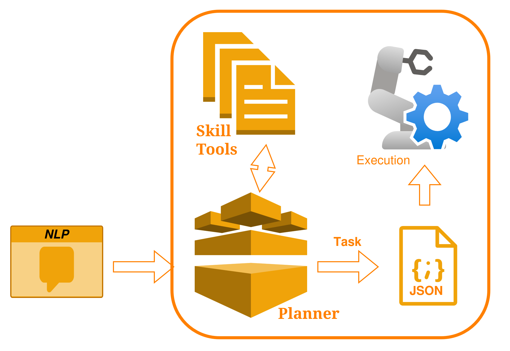

LLM Robot Planner
=================

[](https://github.com/fbot-research/LLM_robot_planner) [](https://instagram.com/furgbot)





An optimal orchestrator for planning and executing robotic actions controlled by an LLM. It constructs a structured prompt (rules, persona, tools, and examples), sends it to the model via the Ollama client, interprets the LLM's response as a sequence of actions in JSON, and executes the actions mapped to Python functions (tools) — many of them wrappers for ROS 2 commands.

#### Architecture


The architecture organizes the components that build and execute LLM-driven plans: prompt construction (system base prompt, available tools, user task and context), local LLM inference via the Ollama client, JSON parsing of the LLM's response into an action sequence, and an execution layer that maps actions to Python tools and ROS2 wrappers. These modular layers interact in a loop—generate prompt, infer, interpret, execute—until the task reaches its completion condition.



More detail of project structure and module formats on Architecture section.


#### Results


Results presentation


<!-- Indices and tables
==================

* :ref:`genindex`
* :ref:`modindex`
* :ref:`search` -->


```{toctree}
:maxdepth: 2
:caption: Contents:

architecture/index
tools/index
tests/index
tutorial/index
applications/index
references/index
```
